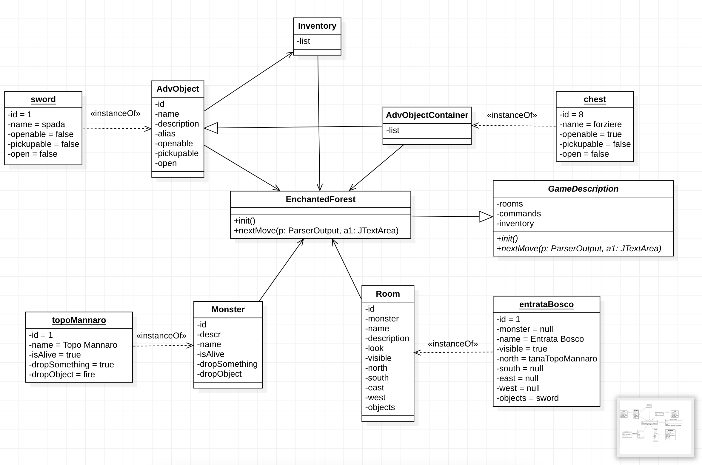

# Enchanted Forest
***
## Indice
1. [Introduzione](#introduzione)
2. [Diagramma delle classi](#diagramma-delle-classi)
3. [Specifica algebrica](#specifica-algebrica)
4. [Applicazione degli argomenti trattati](#applicazione-degli-argomenti-trattati)

***

## Introduzione

Il progetto consiste nella realizzazione di un'avventura testuale,
dove l'obiettivo è quello di trovare la strada per uscire da un bosco incantato.
Il giocatore si trova in un bosco, e può muoversi in quattro direzioni:
nord, sud, est e ovest. Il bosco è composto da una serie di stanze,
ognuna delle quali ha un nome e può contenere oggetti. 
Il giocatore può raccogliere gli oggetti e può usarli per poter proseguire il suo cammino.
Il gioco termina quando il giocatore trova il modo per poter raggiungere la stanza finale, e infine poter affrontare il boss finale.
In base alle azioni compiute in precedenza il finale varierà.

## Diagramma delle classi

### Descrizione del diagramma delle classi:

Abbiamo scelto di rappresentare le classi che elencheremo e descriveremo sotto per rappresentare il diagramma delle classi, poichè abbiamo reputato siano le classi principalmente attive durante l'esecuzione del programma.

Il diagramma delle classi è composto da 6 classi:
- **EnchantedForest**: E' la classe che contiene principalmente un metodo legato all'inizializzazione della partita e
un metodo che permette di poter eseguire gli spostamenti tra una stanza ed un'altra;
- **Room**: E' la classe che rappresenta una stanza, e contiene i metodi per poterla gestire;
- **AdvObject**: E' la classe che rappresenta un oggetto, e contiene i metodi per poterlo gestire;
- **AdvObjectContainer**: E' la classe che rappresenta un contenitore di oggetti, e contiene i metodi per poterlo gestire;
- **Inventory**: E' la classe che rappresenta l'inventario del giocatore, e contiene i metodi per poterlo gestire;
- **Monster**: E' la classe che rappresenta i mostri, e contiene i metodi per poterlo gestire.

Di fatto nel diagramma delle classi abbiamo sia le classi sopra citate, che anche degli esempi di oggetti appartenenti a tali classi
come:
- **sword**: E' un oggetto che è in possesso del giocatore fin dall'inizio della partita, e può essere usato per poter sconfiggere i mostri ed è un'istanzazione della classe AdvObject;
- **chest**: E' un contenitore di oggetti che può essere aperto dal giocatore, e può contenere oggetti utili per poter proseguire il gioco ed è un'istanzazione della classe AdvObjectContainer;
- **entrataBosco**: E' la stanza iniziale del gioco, ed è un'istanzazione della classe Room;
- **topoMannaro**: E' un mostro che può essere sconfitto dal giocatore, ed è un'istanzazione della classe Monster;

Nel diagramma delle classi sono presenti anche delle relazioni tra le classi, come:
- **AdvObjectContainer** è una classe che eredita da **AdvObject**;
- **EncantedForest** dipende dalle classi **Room**, **AdvObject**, **AdvObjectContainer**, **Inventory** e **Monster**;
- **Inventory** dipende dalla classe **AdvObject**;

## Specifica algebrica

Abbiamo preso in esame la struttura dati lista, appartenente alla classe **Inventory** che fa riferimento alla classe **AdvObject**, di conseguenza il metodo set è già inizializzato.

### Specifica Sintattica:

- **Sorts**: 
    - **List, TipoElem, Boolean**
- **Operations**:
  - **setList**(List) -> List
  - **getList**(List) -> List
  - **add**(List, TipoElem) -> List
  - **remove**(List, TipoElem) -> List
  - **isempty**(List) -> Boolean

### Specifica Semantica:

- **declare**:
    - L : **List**;
    - o : **TipoElem**;
- getList(setList(L)) = L;
- add(setList(L), o) = L';
- remove(add(setList(L), o), o) = L;
- remove(setList(L), o) = L';
- isempty(L) = if (L = <>) then true else false;
- isempty(setList(L)) = false; //di base la lista che passiamo è popolata, però dopo una catena di remove() potrebbe diventare vuota.
- isempty(remove(L, o)) = if isempty(L) then error else (if (L = <o>) then true else false);
- remove(L, o) = if (isempty(L)) then error else L';

### Specifica di restrizione:

- **restrictions**:
    - Abbiamo identificato dei casi di errore che indichiamo nella specifica semantica.

## Applicazione degli argomenti trattati

### File:
I file sono stati utilizzati per l'inserimento e la lettura delle descrizioni e osservazioni di stanze, mostri e oggetti.
Dove per ogni tipologia sopra elencata abbiamo un file dedicato.
Per implementare i File abbiamo utilizzato il DataOutputStream e il DataInputStream, che ci permettono di poter scrivere e leggere con maggiore facilità le informazioni all'interno dei file.

### DB:
Il DB è stato utilizzato per la memorizzazione del tempo di gioco della partita, mediante l'utilizzo del Database Engine H2.
Al termine della partita, il giocatore visualizzerà il tempo impiegato per poter completare il gioco, tale tempo è stato prima salvato nel DB per poi essere visualizzato.
Il giocatore può visualizzare esclusivamente il tempo di gioco della partita appena terminata.
Il dialogo con il DB è stato gestito tramite le REST.

### Thread:
Per la creazione del Thread abbiamo utilizzato l'interfaccia Runnable, che ci permette di poter creare un Thread mediante l'implementazione del metodo run().  
I Thread sono stati utilizzati per la gestione del tempo di gioco della partita.
Quando premiamo il pulsante start, si avvia il thread responsabile del conteggio del tempo di gioco. Quest'ultimo viene interrotto al termine della partita.
Il conteggio del tempo di gioco è stato effettuato mediante una differenza tra il tempo iniziale e il tempo finale, dove il tempo iniziale viene letto dalla macchina ospitante mediante il metodo "System.currentTimeMillis();".

### Socket e/o REST:
Abbiamo utilizzato le REST in due circostanze diverse, che sono:
- La prima è per poter gestire il dialogo con il DB, dove abbiamo utilizzato le REST per poter effettuare le operazioni di lettura e scrittura sul DB e per ricevere l'output del tempo di gioco;
- La seconda abbiamo utilizzato la connessione con il server dell'applicazione OpenWeather, per poter ricevere le informazioni riguardanti il meteo della città di Bari, e poter così stampare una frase in base al meteo attuale della città.

### SWING:
Abbiamo utilizzato la libreria SWING per poter creare l'interfaccia grafica del gioco.
Abbiamo realizzato un'interfaccia iniziale che permette al giocatore di avviare la partita (tramite il pulsante start) oppure di uscire dall'applicazione (tramite il pulsante exit).
Una volta avviata la partita, il giocatore visualizzerà il testo dell'intera avventura nella JTextArea, e potrà interagire con il gioco tramite la JTextField.
I comandi con le relative conseguenze saranno visualizzati nella JTextArea che potrà cambiare i colori dello sfondo tramite un apposito pannello collocato in alto, dove il giocatore potrà selezionare il colore che preferisce.
Dopo aver inserito un comando, il giocatore dovrà premere il pulsante "invia" oppure il JButton "Ok" per poter inviare il comando e visualizzare le conseguenze.
Alla fine del gioco, il giocatore visualizzerà il tempo impiegato per completare il gioco tramite una JOptionPane.

### Lambda expression:
Abbiamo utilizzato le lambda expression in tre situazioni:
- Per poter effettuare i controlli relativi agli oggetti utilizzati dal giocatore quando utilizza il comando "usa", "dare" e "attacca".
- Per convertire in secondi il tempo di gioco, che viene visualizzato al termine della partita.
- Per dare una maggiore leggibilità ai metodi checkForCommand() e checkForObjects() che fanno parte della classe Parser().

